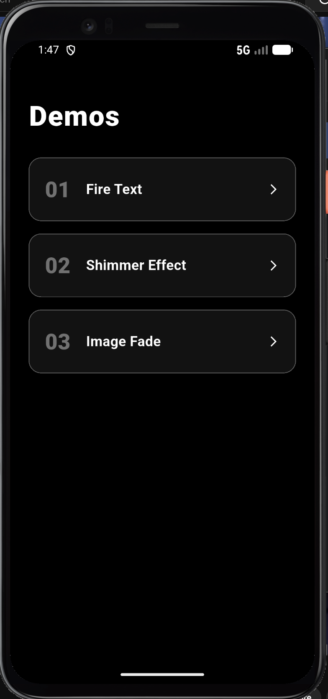

# ShaderMask Flutter Demo

`ShaderMask` is a built-in Flutter widget that paints a shader — most commonly a gradient — over a child widget, blending the two together using a blend mode you control.

## Run Instructions

```bash
flutter pub get
flutter run
```

Requires Flutter 3.x. No extra dependencies — everything uses the Flutter SDK.

## About ShaderMask

`ShaderMask` sits between your widget tree and the screen. It renders the child widget first, then applies a shader on top of it using a blend operation. Because the shader is sized to the child's bounding box, it adapts automatically to whatever widget you wrap — a single `Text`, an `Image`, or an entire layout.

The basic structure always looks like this:

```dart
ShaderMask(
  shaderCallback: (Rect bounds) => someGradient.createShader(bounds),
  blendMode: BlendMode.srcIn,
  child: Text('FLUTTER'),
)
```

This demo app has three real-world examples — fire text, a shimmer effect, and an image fade — each with a toggle button so you can compare the widget on and off side by side.

## The Three Attributes

### 1. `shaderCallback`
**What it is:** A function with the signature `Shader Function(Rect bounds)`. Flutter calls this function every time the widget needs to be painted, passing in the bounding box of the child so you can size the shader to it.

**What it changes on screen:** This is what defines the actual visual — the colors, direction, and spread of the effect. Change it and the entire look of the shader changes.

```dart
// Fire gradient — bottom red, top white
shaderCallback: (bounds) => LinearGradient(
  begin: Alignment.bottomCenter,
  end: Alignment.topCenter,
  colors: [Color(0xFFFF0000), Color(0xFFFF8C00), Color(0xFFFFFFFF)],
).createShader(bounds),
```

### 2. `blendMode`
**What it is:** A `BlendMode` enum value that controls how the shader is composited onto the child widget. Think of it as the "mixing rule" between the shader layer and the child layer.

**What it changes on screen:** Different blend modes produce completely different effects from the same shader:

- `BlendMode.srcIn` — Paints the child using the shader's colors, but only where the child already has pixels. On text, the gradient only appears through the letters, not the space around them. Used in the Fire Text and Shimmer demos.
- `BlendMode.dstIn` — Uses the shader's alpha (transparency) to cut into the child. Where the shader fades to transparent, the child fades too. Used in the Image Fade demo to dissolve the bottom of the image.

### 3. `child`
**What it is:** The single widget that `ShaderMask` wraps. It can be any widget — `Text`, `Image`, `Container`, or a whole subtree.

**What it changes on screen:** The child determines the shape and content the shader gets applied to. Because `ShaderMask` works at the pixel level, switching the child from a `Text` to an `Image` completely changes the result even with the same `shaderCallback` and `blendMode`. The shader only affects the pixels the child actually draws — transparent or empty areas are left untouched.

## Screenshot



## Presentation Date

June 1, 2026
